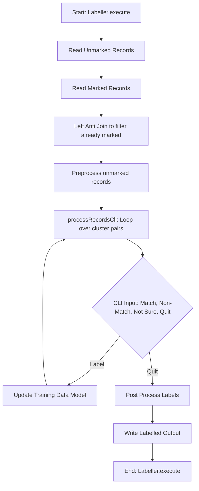
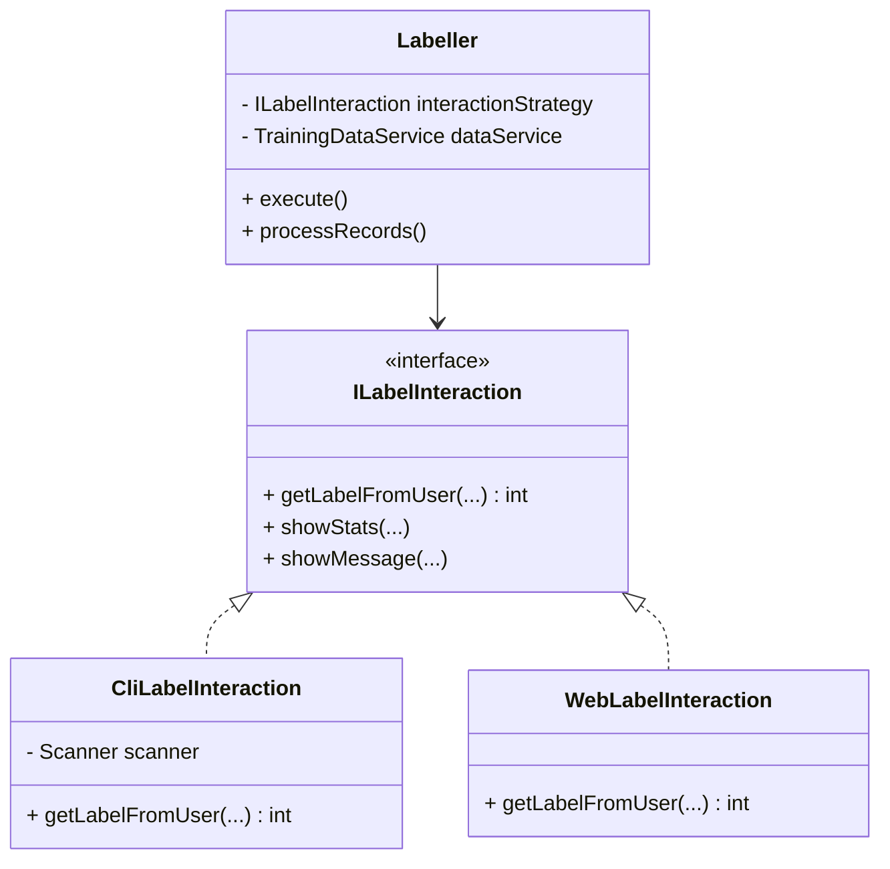

# Design Critique: `Labeller.java`

This document provides a design critique and refactoring suggestions for the `zinggAI/zingg/main/common/core/src/main/java/zingg/common/core/executor/Labeller.java` file.

## 1. Overview and Current Design

`Labeller.java` is an abstract class that handles the core workflow of active learning / manual labelling in Zingg. It inherits from `ZinggBase` and implements `IPreprocessors`.

Its responsibilities seem to include:
1. Reading unmarked and marked records.
2. Preprocessing records.
3. Looping over record pairs and requesting user input via CLI.
4. Saving the user choices and updating training data models.

### Current Workflow Diagram



---

## 2. Code Smells and Design Issues

### 2.1. Single Responsibility Principle (SRP) Violation
The `Labeller` class is trying to do too much. It handles data pipeline logic (reading records, joining data frames), user interaction (CLI input reading `readCliInput()`), and business logic (updating models).

**Issue**: `readCliInput()` and `displayRecordsAndGetUserInput()` are heavily tied to a command-line interface. If Zingg were to provide a GUI or a web interface for labelling, this class would have to be modified or duplicated, violating both SRP and the Open-Closed Principle.

### 2.2. Tight Coupling to Concrete Implementations and System Environments
The use of `Scanner(System.in)` directly inside `readCliInput()` tightly couples the `Labeller` to the standard input stream.

### 2.3. Large and Complex Methods
The `processRecordsCli` method is quite large. It mixes getting data frames, selecting clusters, looping through them, formatting messages, requesting user input, and updating state.

### 2.4. Exception Handling
Exceptions like `Exception` and `ZinggClientException` are sometimes caught, logged, and ignored (e.g., in `getUnmarkedRecords()`). This can lead to silent failures and hard-to-debug states.

---

## 3. Proposed Refactoring and Better Design

If I had to write or refactor this code, I would decouple the Data Processing from the User Interaction.

### 3.1. Interface for User Interaction
Create an interface for the labelling interface. This allows plugging in CLI, Web, or GUI labellers without changing the core data processing logic.

```java
public interface ILabelInteraction<D, R, C> {
    int getLabelFromUser(ZFrame<D, R, C> pair, String preMessage, String postMessage);
    void showStats(long pos, long neg, long notSure, long total);
    void showMessage(String message);
}
```

### 3.2. Refactored `Labeller` Structure
The `Labeller` would take this `ILabelInteraction` as a dependency (Dependency Injection).

```java
public abstract class Labeller<S,D,R,C,T> extends ZinggBase<S,D,R,C,T> {
    private final ILabelInteraction<D, R, C> interactionStrategy;

    public Labeller(ILabelInteraction<D, R, C> interactionStrategy) {
        this.interactionStrategy = interactionStrategy;
    }

    // execute() and processRecords() use interactionStrategy instead of System.in
}
```

### 3.3. Extract Data Pipeline Logic
Move the DataFrame operations (joining unmarked and marked records) into a dedicated Data Access Object or Data Pipeline Service.

### Proposed Architecture Diagram



### 3.4. Method Refactoring
Break `processRecordsCli` down into smaller, testable methods.

1.  `fetchClustersToBeLabelled()`
2.  `processSinglePair()`

This improves readability, testability, and maintainability.

## 4. Conclusion
The current `Labeller.java` is functional but tightly couples core data processing with command-line user interaction. By applying the Single Responsibility Principle and Dependency Inversion, we can extract the user interface logic into an interchangeable component, making the system more modular, testable, and future-proof for adding web or GUI labelling interfaces.
